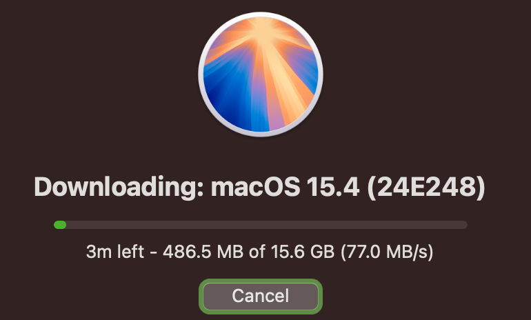

# hacktinosh-dell-latitude-7310-sequoia-15.4

> 💻 EFI patchata per macOS Sequoia 15.4 su **Dell Latitude 7310**, basata su guida [Dortania](https://dortania.github.io/OpenCore-Install-Guide/).



## ✅ Stato compatibilità

| Componente              | Stato     | Note                                                             |
|-------------------------|-----------|------------------------------------------------------------------|
| CPU (Intel)             | ✅ OK      | Supporto nativo con config ACPI patchata                         |
| GPU integrata (UHD)     | ✅ OK      | Accelerazione grafica abilitata (con framebuffer patch)         |
| Audio (ALC)             | ✅ OK      | Codec supportato con layout-id                                   |
| Wi-Fi / BT              | ✅ OK*     | Richiede sostituzione/modulo compatibile o kext patch           |
| Touchpad                | ✅ OK      | I2C supportato con `VoodooI2C` + `VoodooInput`                   |
| Batteria                | ✅ OK      | `SMCBatteryManager` in uso                                       |
| Sleep / Wake            | ✅ OK      | Funziona correttamente                                           |
| USB                     | ✅ OK      | Mappatura porte USB personalizzata (USBMap.kext incluso)         |
| HDMI Out                | ✅ OK      | Video + audio HDMI funzionanti                                   |
| Webcam                  | ✅ OK      | Supportata nativamente                                           |

> *Verifica il modello della scheda Wi-Fi. Si consiglia **DW1820A** o **Fenvi BCM94360NG** per piena compatibilità OOB.

---

## 🔧 EFI basata su:

- OpenCore `v0.9.x`
- macOS **Sequoia 15.4**
- Guida ufficiale [Dortania OpenCore](https://dortania.github.io/)
- SSDT custom: `SSDT-EC-USBX`, `SSDT-AWAC`, `SSDT-PLUG`
- ACPI patch applicate per i servizi energetici

---

## 📁 Struttura

```
EFI/
├── BOOT/
│   └── BOOTx64.efi
├── OC/
│   ├── ACPI/
│   ├── Drivers/
│   ├── Kexts/
│   ├── Tools/
│   └── config.plist
```

---

## 🚀 Installazione rapida

1. Formatta USB in FAT32 → `EFI` come volume
2. Copia la cartella `EFI` fornita nella root della USB
3. Avvia il Dell 7310, entra nel BIOS:
   - Disabilita Secure Boot
   - Attiva AHCI
   - Attiva `CFG-Lock` se non già disattivato (o patcha)
4. Avvia da USB e installa macOS normalmente
5. Dopo l’installazione, copia la EFI su SSD (ESP)

---

## 🛠️ Kext inclusi principali

- `Lilu.kext`
- `VirtualSMC.kext`
- `WhateverGreen.kext`
- `AppleALC.kext`
- `IntelMausi.kext` (Ethernet)
- `VoodooPS2Controller.kext`
- `VoodooI2C.kext` + `VoodooInput.kext`
- `USBMap.kext`

---

## 📸 Screenshot


---

## 🧠 Credits

- Dortania Team per la guida e i tools
- Hackintosh community per supporto e debug
- [CorpNewt](https://github.com/corpnewt) per tools utili (`ProperTree`, `GenSMBIOS`)

---

## ⚠️ Disclaimer

Questo progetto è solo a scopo **educativo**. macOS è un software proprietario di Apple Inc. L'utilizzo su hardware non Apple **viola i termini di licenza EULA**. Procedi a tuo rischio e pericolo.

---

quasi fatto zio c ho avuto na rogna mo finisco e te kiamo